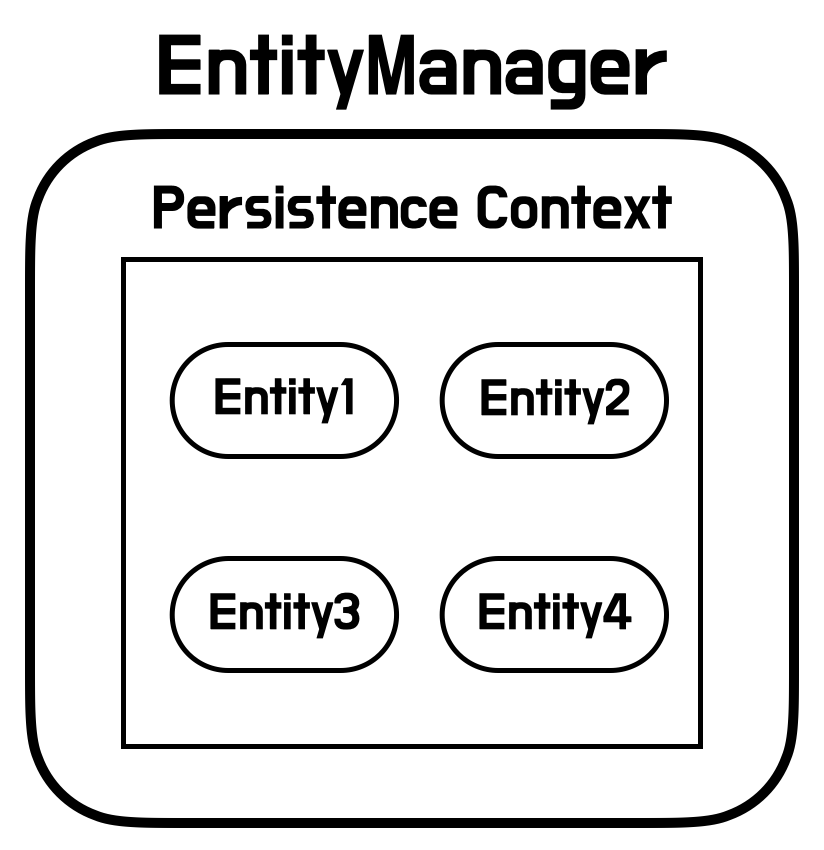

## 개요

Spring 프로젝트를 진행하며 테스트 코드 작성 중 테스트가 의도대로 동작하지 않았습니다.

연관관계에 놓여 있는 두 테이블이 존재할 때 각 테이블의 `Entity`를 생성하고 저장했을 때 연관관계에 알맞게 데이터가 연결되어 불러와지는 동작을 의도했지만, 실제 결과는 연결된 값을 가져오지 못하는 문제가 발생하였습니다.

이를 해결하기 위해 검색을 해보았고 Entity를 관리하는 `EntityManager`의 존재를 알게 되었습니다.
EntityManager를 사용하여 위의 문제를 해결할 수 있었고 **정리한 내용**, **문제**, **해결**에 대해 작성하고자 합니다.

## 정리

### Entity

사전적인 의미로는 사물의 본질적인 성질을 속성(attribute)이라 하고, 관련 있는 속성들이 모여 의미 있는 하나의 정보 단위를 이룬 것이 `엔티티(Entity)`라고 합니다.<br>
파일시스템이나 데이터베이스에서의 **레코드**가 Entity에 해당하게 됩니다.

JPA에서는 클래스에 `@Entity` 어노테이션을 붙여 DB 테이블과 매핑시켜 사용할 수 있습니다.<br>
간단하게 설명하자면 DB에서 영속성으로 저장된 데이터를 자바의 클래스 객체로 매핑하여 **존재하는 데이터**를 의미하게 됩니다.

### EntityManager

`EntityManager`란 영속성 컨텍스트와 상호작용하는데 사용되는 인터페이스입니다.



EntityManager는 영속성 컨텍스트와 연결되는데 `영속성 컨텍스트`란 모든 Entity ID에 대해 고유한 Entity를 가지는 집합을 의미합니다.<br>
영속성 컨텍스트 내에서 `Entity 인스턴스`와 `라이프 사이클`이 관리됩니다.<br>
EntityManager는 인터페이스로 API를 제공하게 되는데 이는 Entity 인스턴스를 생성하고 제거할 수 있고, 키를 통해 Entity를 찾을 수도 있습니다.

### EntityManagerFactory

EntityManager는 **Thread-safe** 하지 않기 때문에 스레드 간 공유되면 안 되는 자원입니다.<br>
따라서 `EntityManagerFactory`를 통해 스레드별로 EntityManager를 생성해줘야 합니다.

EntityManagerFactory는 **Thread-safe**를 보장합니다.

```java
EntityManagerFactory emf = Persistence.createEntityManagerFactory("singleton");
EntityManager em = emf.createEntityManager();
```

- EntityManagerFactory는 생성 비용이 크기 때문에 싱글톤으로 관리합니다.
- EntityManager는 생성 비용이 많이 들지 않기 때문에 스레드마다 생성해서 사용합니다.
- EntityManager는 트랜잭션이 발생할 때 DB 커넥션 풀에서 커넥션을 얻어 사용합니다.

## 문제
