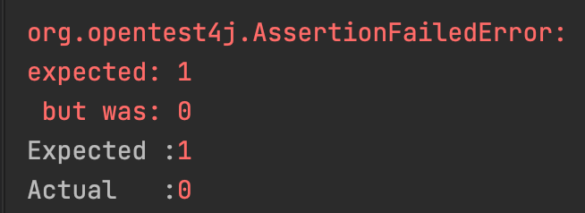

## 개요

Spring 프로젝트를 진행하며 테스트 코드 작성 중 테스트가 의도대로 동작하지 않았습니다.

연관관계에 놓여 있는 두 테이블이 존재할 때 각 테이블의 `Entity`를 생성하고 저장했을 때 연관관계에 알맞게 데이터가 연결되어 불러와지는 동작을 의도했지만, 실제 결과는 연결된 값을 가져오지 못하는 문제가 발생하였습니다.

이를 해결하기 위해 검색을 해보았고 Entity를 관리하는 `EntityManager`의 존재를 알게 되었습니다.
EntityManager를 사용하여 위의 문제를 해결할 수 있었고 **정리한 내용**, **문제**, **해결**에 대해 작성하고자 합니다.

## 정리

### Entity

사전적인 의미로는 사물의 본질적인 성질을 속성(attribute)이라 하고, 관련 있는 속성들이 모여 의미 있는 하나의 정보 단위를 이룬 것이 `엔티티(Entity)`라고 합니다.<br>
파일시스템이나 데이터베이스에서의 **레코드**가 Entity에 해당하게 됩니다.

JPA에서는 클래스에 `@Entity` 어노테이션을 붙여 DB 테이블과 매핑시켜 사용할 수 있습니다.<br>
간단하게 설명하자면 DB에서 영속성으로 저장된 데이터를 자바의 클래스 객체로 매핑하여 **존재하는 데이터**를 의미하게 됩니다.

### EntityManager

`EntityManager`란 영속성 컨텍스트와 상호작용하는데 사용되는 인터페이스입니다.


EntityManager는 영속성 컨텍스트와 연결되는데 `영속성 컨텍스트`란 모든 Entity ID에 대해 고유한 Entity를 가지는 집합을 의미합니다.<br>
영속성 컨텍스트 내에서 `Entity 인스턴스`와 `라이프 사이클`이 관리됩니다.<br>
EntityManager는 인터페이스로 API를 제공하게 되는데 이는 Entity 인스턴스를 생성하고 제거할 수 있고, 키를 통해 Entity를 찾을 수도 있습니다.

### EntityManagerFactory

EntityManager는 **Thread-safe** 하지 않기 때문에 스레드 간 공유되면 안 되는 자원입니다.<br>
따라서 `EntityManagerFactory`를 통해 스레드별로 EntityManager를 생성해줘야 합니다.

EntityManagerFactory는 **Thread-safe**를 보장합니다.

```java
EntityManagerFactory emf = Persistence.createEntityManagerFactory("singleton");
EntityManager em = emf.createEntityManager();
```

- EntityManagerFactory는 생성 비용이 크기 때문에 싱글톤으로 관리합니다.
- EntityManager는 생성 비용이 많이 들지 않기 때문에 스레드마다 생성해서 사용합니다.
- EntityManager는 트랜잭션이 발생할 때 DB 커넥션 풀에서 커넥션을 얻어 사용합니다.

## 문제

```java
@Builder
@Entity
@Getter
@NoArgsConstructor
@AllArgsConstructor
@Table(name = "title")
public class TitleEntity {

  @Id
  @GeneratedValue(strategy = GenerationType.IDENTITY)
  private Long id;

  @Column(length = 50)
  private String title;

  @Column(length = 40)
  private String type;

  @OneToMany(mappedBy = "title", cascade = CascadeType.REMOVE)
  @Builder.Default
  private List<SubtitleEntity> subtitles = new ArrayList<>();

}
```

```java
@Builder
@Entity
@Getter
@NoArgsConstructor
@AllArgsConstructor
@Table(name = "subtitle")
public class SubtitleEntity {

  @Id
  @GeneratedValue(strategy = GenerationType.IDENTITY)
  private Long id;

  @Column(length = 250)
  private String subtitle;

  @Column(name = "display_order", nullable = false)
  private Integer displayOrder;

  @ManyToOne
  @JoinColumn(name = "title_id", nullable = false)
  private TitleEntity title;

}
```

- `title`과 `subtitle`을 양방향 연관관계로 지정

```java
@Test
@DisplayName("연결된 서브타이틀과 함께 페이지 블럭 타이틀 조회")
void getTitleWithSubtitle() {
    // given
    TitleEntity title = TitleEntity.builder()
        .title("Entity Manager 소개글")
        .type("test")
        .build();

    TitleEntity savedTitle = TitleRepository.save(title);

    SubtitleEntity subtitle = SubtitleEntity.builder()
        .subtitle("Entity란?")
        .displayOrder(1)
        .title(savedTitle)
        .build();

    SubtitleRepository.save(subtitle);

    // when
    List<TitleEntity> titles = TitleRepository.findAllByType("test");

    // then
    assertThat(titles.size()).isEqualTo(1);
    assertThat(titles.get(0).getSubtitles().size()).isEqualTo(1);
    assertThat(titles.get(0).getSubtitles().get(0).getSubtitle()).isEqualTo("Entity란?");
}
```

- title과 하위 subtitle을 저장했을 때 title을 불러오면 `연관된 subtitle`이 같이 불러와지는 테스트 코드 작성



하지만 예상했던 결과와 다르게 **하위 subtitle을 불러오지 못하는 문제**가 발생했습니다.<br>
그 원인은 1차 캐시를 해서 영속성 컨텍스트에 저장된 연관관계를 그대로 가져오기에 발생하는 문제였습니다.

title은 subtitle 없이 영속성 컨텍스트에 들어가 있고 1차 캐시로 인해 없는 상태 그대로 가져오게 됩니다.<br>
이를 해결해주기 위해서는 영속성 컨텍스트 캐시를 `초기화`시켜주는 작업이 필요했습니다.

## 해결

```java
@Test
@DisplayName("연결된 서브타이틀과 함께 페이지 블럭 타이틀 조회")
void getTitleWithSubtitle() {
    // given
    TitleEntity title = TitleEntity.builder()
        .title("Entity Manager 소개글")
        .type("test")
        .build();

    TitleEntity savedTitle = TitleRepository.save(title);

    SubtitleEntity subtitle = SubtitleEntity.builder()
        .subtitle("Entity란?")
        .displayOrder(1)
        .title(savedTitle)
        .build();

    SubtitleRepository.save(subtitle);

    // when
    // 영속성 컨텍스트에 저장되어 있는 값을 지워버린다
    entityManager.clear();

    List<TitleEntity> titles = TitleRepository.findAllByType("test");

    // then
    assertThat(titles.size()).isEqualTo(1);
    assertThat(titles.get(0).getSubtitles().size()).isEqualTo(1);
    assertThat(titles.get(0).getSubtitles().get(0).getSubtitle()).isEqualTo("Entity란?");
}
```

- entityManager를 이용해 영속성 컨텍스트를 초기화시켜 제대로 된 `select` 문으로 가져오게 처리합니다.
- 테스트 의도대로 수행

### EntityManager 주요 메서드

그 외에도 주로 사용되는 메서드는 다음과 같습니다.

- `persist()` : 실제 DB에 저장하는 것이 아닌 영속성 컨텍스트에 Entity 영속화
- `detach()` : 영속성 컨텍스트에 저장되었다가 분리된 상태, 준영속 상태
- `remove()` : 실제 DB에 삭제를 요청한 상태
- `flush()` : 영속성 컨텍스트에 있는 데이터를 DB로 쿼리 전송, 실제 DB에 반영되지는 않는다, 변경 내용을 DB와 동기화하는 작업
- `commit()` : 실제 쿼리가 실행되는 단계, DB 변화 발생
- `clear()` : 영속성 컨텍스트의 데이터를 제거, 실제 DB에서 지워지는 것은 아니다
