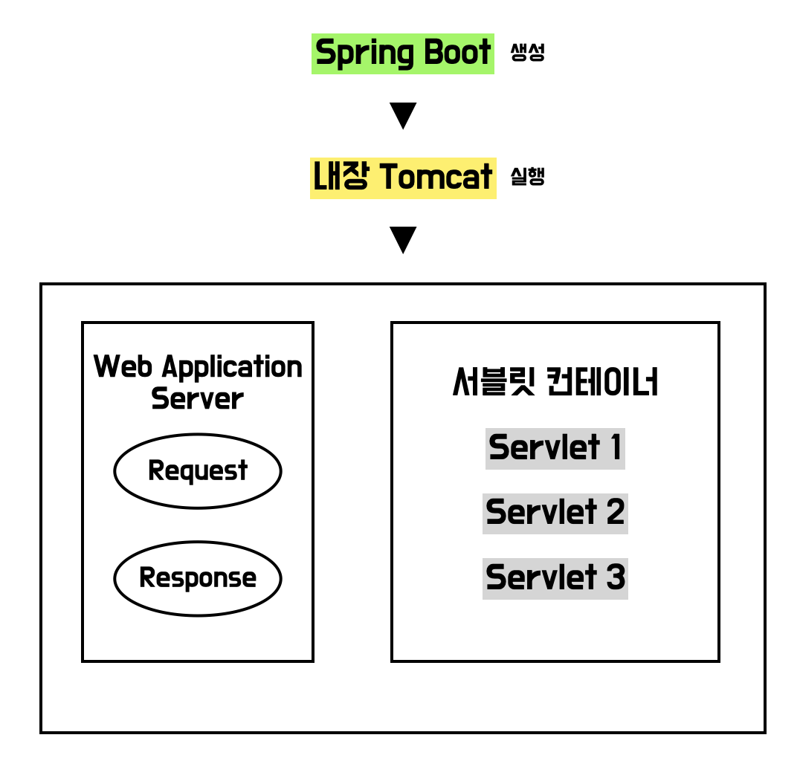
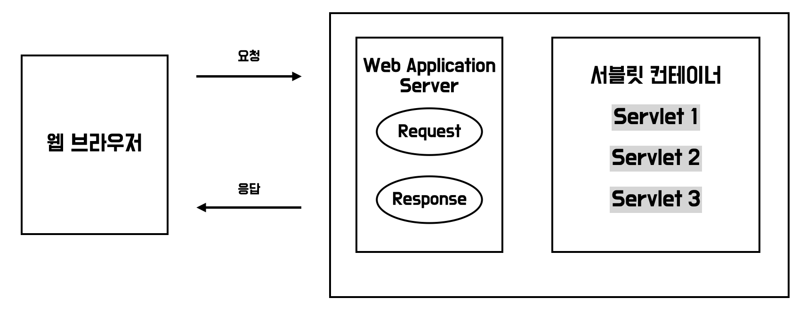

## 🚀 정의

### 📗 사전적 정의

자바를 사용하여 웹페이지를 동적으로 생성하는 서버 측 프로그램 혹은 그 사양을 말하며 웹 서버의 성능을 향상하기 위해 사용되는 `자바 클래스`의 일종입니다. HTML 안에 자바 코드를 담고 있는 `JSP`와 다르게 자바 코드 안에 HTML을 담고 있는 것이 특징입니다.

`정적 웹페이지`는 서버에 있는 HTML+CSS를 그대로 보여주는 것

- 파일 경로 이름을 바탕으로 `Web Server`가 일치하는 content를 반환하게 됩니다.

`동적 웹페이지`는 상황에 따라 데이터를 추가/가공해서 보여주는 것

- 요청 인자에 알맞게 동적으로 content를 생산하여 `Web Application Server`가 content를 반환하게 됩니다.

### 📗 스프링부트에서의 정의

서블릿은 `Tomcat` 같은 웹 애플리케이션 서버를 설치하고 서블릿 코드를 빌드해서 클래스 파일로 만든 뒤 서버를 실행해서 동작하게 됩니다.

스프링부트에서는 톰캣 서버를 내장하고 있기에 서블릿 코드를 간편하게 실행할 수 있습니다.



- 스프링부트 프로젝트를 생성하고 내장 Tomcat 서버를 실행하게 되면 존재하는 서블릿 코드를 탐색하게 되고 `서블릿 컨테이너`가 이를 관리하게 됩니다.
- Http 요청과 응답에 대한 `HttpServletRequest`, `HttpServletResponse`를 서블릿 코드에서 처리할 수 있습니다.

## 🚀 역할



- 웹 브라우저에서 실행 중인 서버로 요청이 들어오면 요청에 알맞은 처리 이후 응답해주는 작업이 필요한데 HTTP 요청 메시지를 직접 파싱하고 HTTP 응답을 직접 관리하기에는 불편한 점이 존재합니다.

> HttpServletRequest

개발자가 HTTP 요청 메시지를 편리하게 사용할 수 있도록 개발자 대신 HTTP 요청 메시지를 파싱해서 그 결과를 `HttpServletRequest` 객체에 담아서 제공합니다.

- START LINE
  - HTTP 메소드
  - URL
  - 쿼리 파라미터
  - 스키마, 프로토콜
- HTTP Header
  - 헤더 정보
- HTTP Body
  - Form 파라미터 정보
  - message body 데이터

그 외에도 HTTP 요청 시작부터 종료까지 유지되는 `임시 저장소 기능`, `세션 관리 기능`을 제공합니다.

> HttpServletResponse

개발자가 HTTP 응답 메시지를 편리하게 생성할 수 있도록 편의 기능을 제공합니다.

- HTTP 응답 메시지 생성
  - HTTP 응답 코드 생성
  - HTTP 응답 헤더 생성
  - HTTP 응답 바디 생성

그 외에도 `Content-Type`, `쿠키`, `Redirect` 등을 지정할 수 있습니다.

## 🚀 동작

### 📝 서블릿 등록

```java
@WebServlet(name = "servletExample", urlPatterns = "/servlet-example")
public class ServletExample extends HttpServlet {
    @Override
    protected void service(HttpServletRequest request, HttpServletResponse response) throws ServletException, IOException {
        ...
    }
}
```

- `@WebServlet` : 서블릿 애노테이션으로 서블릿 이름을 지정하고 URL 매핑을 할 수 있습니다.
- 서버의 기본 URL이 `http://localhost:8080`일 때 웹 브라우저에서 `http://localhost:8080/servlet-example`로 요청이 들어오게 되면 해당 Servlet 클래스 코드가 실행됩니다.
- URL이 호출되면 서블릿 컨테이너는 `service()` 메서드를 호출하는데 `HttpServlet` 추상 클래스를 상속받아 해당 메서드를 `Override` 해서 사용합니다.
  - 원하는 동작을 해당 메서드 안에서 구현합니다.

### 📝 서블릿 스캔

```java
@ServletComponentScan
@SpringBootApplication
public class ServletApplication {

    public static void main(String[] args) {
        SpringApplication.run(ServletApplication.class, args);
    }
}
```

- `@ServletComponentScan` : 등록된 서블릿을 스캔해서 빈으로 등록합니다. 빈으로 등록되어 있기에 요청 때마다 생성되는 것이 아닌 싱글톤으로 관리되어 성능에 도움을 줄 수 있습니다.

## 🚀 참고

> [스프링 MVC 1편 - 백엔드 웹 개발 핵심 기술](https://www.inflearn.com/course/%EC%8A%A4%ED%94%84%EB%A7%81-mvc-1/dashboard)
