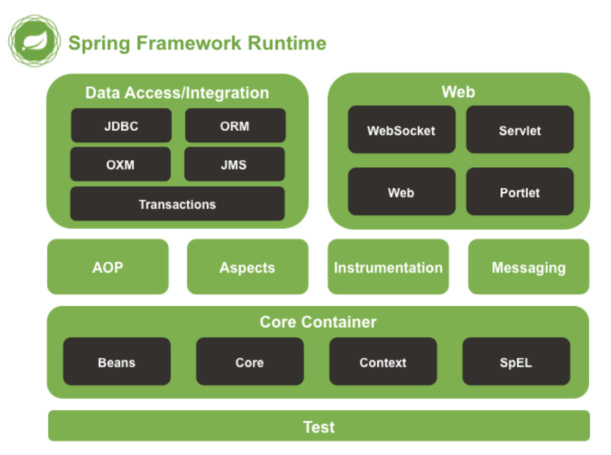

## Spring

### 스프링 프레임워크

자바 플랫폼을 위한 오픈 소스 애플리케이션 프레임워크로 동적 웹 사이트 개발을 위한 여러 가지 서비스를 제공한다.

**주요 특징**  
`제어의 역전`  
프로그래머가 외부 라이브러리 코드를 사용하는 것이 아닌 반대로 동작하는 것을 의미하며 스프링 프레임워크가 객체의 생명주기를 관리한다. 정확히는 각각의 컨테이너가 관리하게 되는 것으로 관리자로서 의존성 주입이 가능해져 각 계층이나 서비스 간의 의존성을 맞출 수 있다.

`관점 지향 프로그래밍(Aspect Oriented Programming)`  
로깅, 보안, 트랙잭션 등 핵심 비즈니스 로직과는 상관없지만 공통적으로 사용되는 부분을 분리해서 관리할 수 있다.  
상하/인터페이스 개념이 아닌 별도의 모듈을 생성해서 관리한다는 의미

`데이터 엑세스 프레임워크`  
JDBC, iBatis(MyBatis), 하이버네이트 등 기능을 제공하여 데이터베이스 프로그래밍을 쉽게 할 수 있다.

`배치 프레임워크`  
스프링 배치는 로깅, 트랙잭션, 작업 관리, 리소스 관리 등 대용량 데이터 처리에 필수적인 재사용 기능을 제공한다.

### 스프링 모듈

스프링 프레임워크는 20가지의 모듈로 구성이 되는데 모두 필수적으로 사용할 필요 없이 필요시에만 원하는 것을 사용할 수 있다.

#### Core
